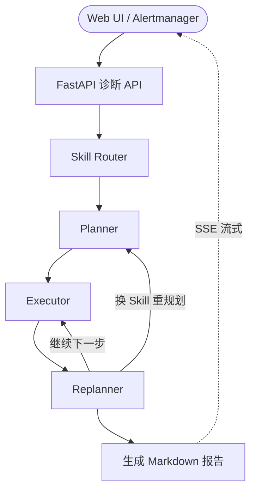
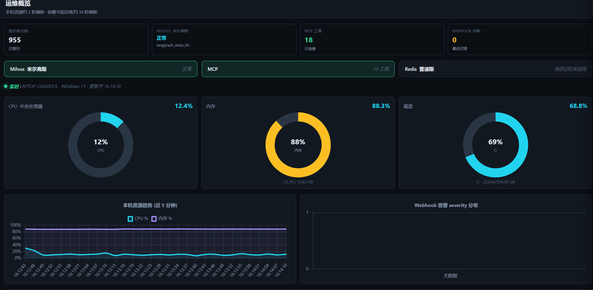
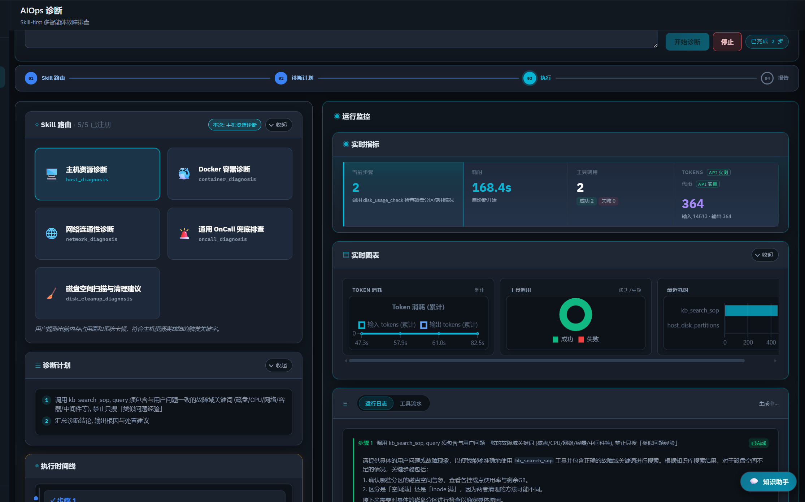

# LangGraph AIOps Platform

面向 OnCall / SRE 场景的多智能体智能运维诊断平台。


基于 `FastAPI`、`LangGraph`、`RAG`、`Milvus`、`MCP` 与大模型构建：**先选 Skill → 规划步骤 → 调用工具 → 生成诊断报告**。可根据告警或故障描述自动选择诊断策略，结合知识库与实时 MCP 工具输出结构化 Markdown 报告。


## 能力概览

- **5 个 Skill**：`host_resource_diagnosis`、`container_diagnosis`、`network_diagnosis`、`disk_cleanup_diagnosis`、`generic_oncall`
- **Plan-Execute-Replan** + **AgentHarness**（prompt / 模型分层 / 降级 / Token 预算）
- **RAG**（Milvus + `docs/sop/` + Prometheus 语料）、**MCP 只读工具**、**SSE 流式**、**Alertmanager Webhook**

## 项目亮点

- **五类 OnCall Skill + Playbook**：`host_resource_diagnosis`（本机 CPU/内存/磁盘/进程）· `container_diagnosis`（Docker 状态/日志/配置）· `network_diagnosis`（连通性/HTTP/DNS/端口）· `disk_cleanup_diagnosis`（目录 TopN、大文件、只读清理建议）· `generic_oncall`（通用告警兜底）；Router 选型后按 Playbook 与工具白名单执行
- **AgentHarness 控制面**：各阶段 prompt、模型分层、Replanner 保护、Reroute 配额、降级与 Token 预算（`backend/runtime/agent_harness.py`）
- **AIOps 演示前端**：五 Skill 卡片、SSE 阶段条、报告常驻、知识库 Tab（统计/分页/Token）
- **MCP 只读工具链**：`host_*` / `net_*` / `container_*` / `kb_*` / `win_*` 等表意命名，元数据登记见 `backend/tools/meta.py`
- **离线评测**：诊断 Skill 命中率 + 报告关键词（`evaluation/run_diagnosis_eval.py`）；RAG R@k / MRR（`scripts/eval_rag_retrieval.py`）→ `reports/`


## 架构概览

**Skill-first**：先选 Skill 与 Playbook，再规划步骤；Executor 只在白名单内调工具；Replanner 决定继续执行、换 Skill 重规划或输出报告。



| 模块 | 作用 |
|------|------|
| **5 个 Skill** | `host_resource` · `container` · `network` · `disk_cleanup` · `generic_oncall`（Router 择一，加载 Playbook + 工具白名单） |
| **AgentHarness** | 各阶段 prompt、模型分层、Replanner 保护、Token 预算与降级（`backend/runtime/agent_harness.py`） |
| **工具 / 存储** | Executor → `kb_search_sop` → Milvus；MCP 只读 `host_*` / `net_*` / `container_*` / `win_*`；Redis 可选（RAG Chat 会话） |
| **输出** | 诊断过程与报告经 **SSE** 流式推送到前端 |

## 界面预览







## 快速开始

```powershell
git clone <your-repo-url>
cd langgraph-aiops-platform
copy .env.example .env
# 编辑 .env：DASHSCOPE_API_KEY、KB_ADMIN_TOKEN
pip install -r requirements.txt
docker compose up -d
python scripts\ingest_kb_corpus.py --reset
powershell -NoProfile -ExecutionPolicy Bypass -File .\run.ps1
```

### 安装补充

- **联网搜索**：默认 `mock`；本地 daemon 可设 `WEB_SEARCH_PROVIDER=open_websearch`、`OPEN_WEBSEARCH_BASE_URL=http://127.0.0.1:3210`（`backend/core/web_search.py`）
- **增量入库 SOP**：`python scripts\ingest_kb_corpus.py --only disk_cleanup_sop.md`
- **停止服务**：`powershell -NoProfile -ExecutionPolicy Bypass -File .\run.ps1 -Stop`

| 页面 | 地址 |
|---|---|
| Web UI | http://localhost:9900 |
| Swagger | http://localhost:9900/docs |
| 健康检查 | http://localhost:9900/api/v1/health |
| Attu Milvus UI | http://localhost:8000 |

## 使用示例

| 场景 | 输入示例 |
|---|---|
| 本机资源 | `我电脑很卡，帮我看下是不是 CPU 或内存太高` |
| Redis 告警 | `Redis 实例 redis-master-01 内存使用率 98%，客户端连接被强制断开` |
| 磁盘清理 | `C 盘只剩 8%，帮我扫描哪些目录占用大并给出清理建议` |

Webhook 模拟：`python scripts\mock_alert.py --scenario disk`


## 评测

指标需本地复现后使用，结果写入 `reports/`。

| 指标 | 复现方式 |
|---|---|
| 诊断 Skill 命中率 | `python evaluation/run_diagnosis_eval.py` |
| 报告关键词召回 | 同上（`data/diagnosis_eval_cases.jsonl`） |
| RAG R@1 / R@3 / MRR | `python scripts/eval_rag_retrieval.py` |
| Token / 步数 | SSE `usage_stats` 或 eval JSON |

```powershell
# 需 run.ps1 已启动且已配置 LLM Key
python evaluation\run_diagnosis_eval.py
python scripts\eval_rag_retrieval.py
```

**最近一次本地复现（`reports/`）**

| 指标 | 结果 | 目标 |
|---|---|---|
| 诊断 Skill 命中率 | **92.9%**（13/14） | ≥ 80% |
| 报告关键词召回 | **96.4%** | — |
| RAG R@3（向量） | **75.0%** | ≥ 85% |
| RAG R@3（Hybrid） | **75.0%** | 同上 |

复现命令见上；全量诊断约 30 分钟（14 条 × LLM 调用）。

## 工具命名

| 前缀 | 示例 |
|---|---|
| `host_` | `host_snapshot`, `host_disk_partitions`, `host_scan_dir_usage` |
| `net_` | `net_ping`, `net_http_probe`, `net_web_search` |
| `container_` | `container_list`, `container_logs_tail` |
| `kb_` | `kb_search_sop` |
| `win_` | `win_events_query` |
| `clock_` | `clock_now` |
| `subagent_` | `subagent_collect_evidence`, `subagent_research_kb` |
| `mcp_` | `mcp_discover_tools`, `mcp_invoke_by_name` |

REST API 见 Swagger：http://localhost:9900/docs

## License

本项目代码以 **MIT License** 发布。

集成或参考的第三方资产：

- **[Aas-ee/open-webSearch](https://github.com/Aas-ee/open-webSearch)** — 本地联网搜索 daemon，由 [`backend/core/web_search.py`](backend/core/web_search.py) 调用。
- **[samber/awesome-prometheus-alerts](https://github.com/samber/awesome-prometheus-alerts)** — Prometheus 告警语料（CC BY 4.0），副本位于 `data/kb_corpus/awesome-prometheus-alerts/`。

